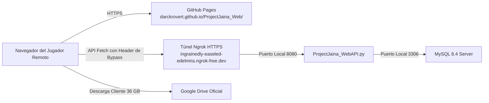

# GOBERNANZA TÉCNICA DEL PORTAL WEB PÚBLICO (PROJECTJAINA_WEB)

**Módulo:** `E:\ProjectJaina_Web`  
**Proyecto:** Project JAIna (Portal Web Oficial AAA & Living Lore)  
**Estándar:** Staff Software Engineer L9 (Mythos 5)  
**Fecha de Actualización:** 09 de Octubre de 2026  
**Líder & Arquitecto General:** DarckRovert (Elnazzareno)  
**Staff AI Engineer:** Antigravity L9 (Mythos 5)  

---

## 1. Misión, Soberanía y Alcance del Módulo

`E:\ProjectJaina_Web` aloja el código fuente del portal web público oficial de Project JAIna. Su propósito es brindar una experiencia AAA inmersiva (Glassmorphism arcano, estética Theramore), telemetría en tiempo real del reino, armería de personajes, catálogo de tienda, diálogo interactivo con Lady Jaina Proudmoore, registro seguro de cuentas de jugadores y distribución del cliente oficial.

El portal es soberano y de código abierto bajo licencia MIT, enlazado directamente al clúster de simulación local mediante túneles seguros.

---

## 2. Topología de Despliegue y Conectividad Híbrida

El portal opera bajo un modelo desacoplado Serverless Frontend + Self-Hosted Backend:



### Tabla de Endpoints y Parámetros Técnicos

| Componente | URL Canónica / Destino | Protocolo / Puerto | Función |
| :--- | :--- | :--- | :--- |
| **Frontend Web** | `https://darckrovert.github.io/ProjectJaina_Web/` | HTTPS (GitHub Pages) | Interfaz visual, páginas HTML/CSS/JS. |
| **Túnel REST API** | `https://ingrainedly-easeled-edelmira.ngrok-free.dev` | HTTPS (Ngrok L7) | Traspaso seguro de consultas y registros. |
| **Backend REST Local** | `http://127.0.0.1:8080` | HTTP (Python WebAPI) | Endpoints `/api/register`, `/api/status`, `/api/armory`, etc. |
| **Descarga de Cliente** | [Carpeta Oficial de Google Drive](https://drive.google.com/drive/folders/1O_E2NbAnVLq5FBAcMMoy8X3-a0VmKgGe?usp=sharing) | HTTPS (Google Cloud) | Distribución de los 35.96 GB de datos del cliente. |

---

## 3. Normativa de Red y Cabeceras Mandatorias (Ngrok Bypass)

Debido a que el túnel de Ngrok opera en el plan gratuito con endpoint estático permanente, la pasarela de Ngrok intercala una pantalla de advertencia intermedia (`ngrok-skip-browser-warning`) si se realizan peticiones `GET` o `POST` desde scripts sin la cabecera adecuada.

### Regla Inmutable de Fetch:
Todo llamado `fetch()` en los módulos de Javascript (`js/register.js`, `js/app.js`, `js/armory.js`, `js/store.js`, `js/jaina_dialogue.js`, `js/countdown.js`) **debe incluir obligatoriamente**:
```javascript
headers: {
    'Content-Type': 'application/json',
    'ngrok-skip-browser-warning': 'true'
}
```
Omitir esta cabecera provocará errores `JSON.parse` inesperados al recibir HTML de intercepción en lugar del JSON de la API.

---

## 4. Gobernanza del Sistema de Registro SRP6 (`/api/register`)

1. **Cero Passwords en Texto Plano:**
   - La WebAPI jamás almacena contraseñas en texto plano.
   - Aplica el algoritmo SRP6 (Secure Remote Password 6) nativo de World of Warcraft 3.3.5a utilizando SHA-1, un salt criptográfico aleatorio de 32 bytes y el generador `g = 7` módulo `N` de Blizzard.
2. **Sanitización de Nombres de Usuario:**
   - Longitud: 3 a 16 caracteres alfanuméricos.
   - Normalización: Conversión estricta a mayúsculas (`UPPER(username)`) antes de inserción en `acore_auth.account`.
3. **Manejo de Respuestas:**
   - La API retorna HTTP `200` con `{ "success": true, "message": "Cuenta creada con éxito" }` o HTTP `400`/`409` con códigos descriptivos de colisión de nombre.

---

## 5. Control de Versiones y Despliegue Continuo (CI/CD)

1. **Rama Principal:** `main` en `https://github.com/DarckRovert/ProjectJaina_Web`.
2. **Políticas de Commit:**
   - Todos los cambios deben probarse primero localmente o verificar la validez sintáctica de JS/CSS.
   - Queda estrictamente prohibido commitear credenciales administrativas de MySQL o tokens privados de sesión.
   - Los enlaces a la API deben provenir de `js/config.js` (`PUBLIC_TUNNEL_API`).
