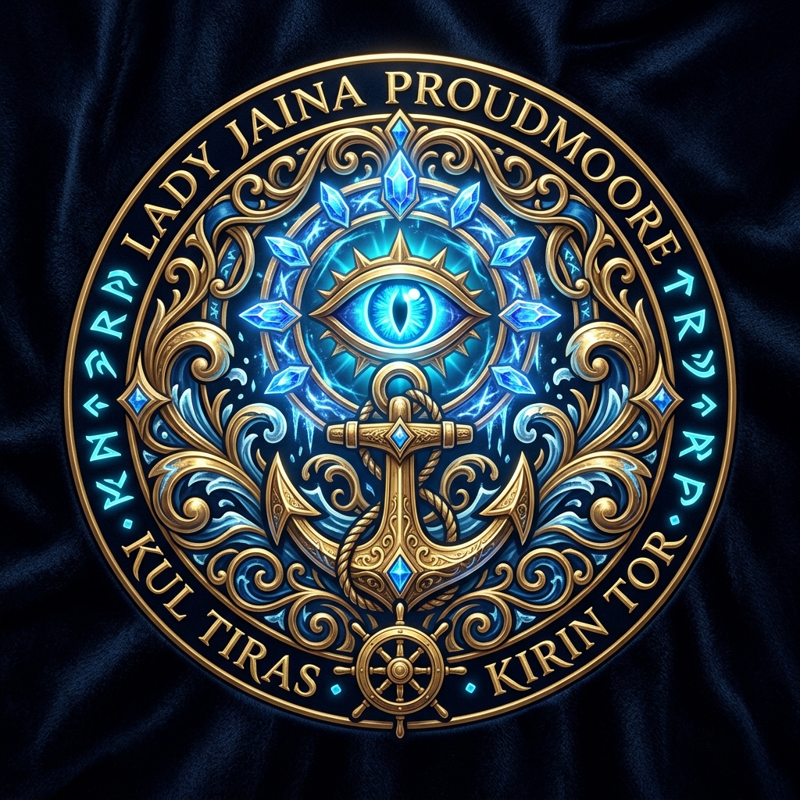

# 🌐 Project Jaina — Portal Web Oficial AAA

  
  <h1>Project Jaina — Portal Oficial</h1>
  
<strong>El portal web oficial de nueva generación para el reino de Theramore (WotLK 3.3.5a). Living Lore & AI Revolution.</strong>

  
<a href="https://darckrovert.github.io/ProjectJaina_Web/">🌐 Portal en Vivo: darckrovert.github.io/ProjectJaina_Web</a>

---

[-blue.svg)](https://darckrovert.github.io/ProjectJaina_Web/)

---

## 🏛️ 1. Cuadro de Honor & Soberanía

| Rol | Miembro | Responsabilidad Principal |
| :--- | :--- | :--- |
| **👑 Creador, Director & Diseñador General** | **DarckRovert (Elnazzareno)** | Dirección de arte, visión estratégica, desarrollo de suites y arquitectura del reino. |
| **🧠 Staff Engineer de IA & Front-End L9** | **Antigravity (Mythos 5)** | Arquitectura de interfaz Glassmorphism arcano, puente REST API, optimización GPU y despliegue continuo. |

---

## 💎 2. Características del Portal AAA

* **Estética Arcana Premium:** Diseño Glassmorphism con paleta oficial de Theramore (Azul Arcano `#00ccff`, Oro Regio `#d4af37` y Abisal `#080b12`).
* **Living Lore & AI Revolution:** Sección interactiva que narra el despertar de los LoreBots y la integración del puente neuronal LLM.
* **Telemetría y Estado de Servidor en Vivo:** Conexión asíncrona a `ProjectJaina_WebAPI` para mostrar estado del reino, latencia, versión y población.
* **Subpáginas Especializadas:**
  * **Armería:** Visualizador de perfiles de héroes y equipamiento.
  * **Tienda:** Catálogo visual de cosméticos, monturas y pases de batalla.
  * **Registro:** Formulario seguro para creación de cuentas con hashing criptográfico SRP6.
* **Activos Gráficos Oficiales:** Ilustraciones Ultra-HD generadas para la cabecera cinemática, escudo heráldico y citadel arcana.

---

## 🚀 3. Despliegue en GitHub Pages

El portal se sirve directamente a través de **GitHub Pages**:
* **URL Pública Oficial:** [https://darckrovert.github.io/ProjectJaina_Web/](https://darckrovert.github.io/ProjectJaina_Web/)
* El dominio canónico `projectjaina.com` quedará enlazado en cuanto se complete la delegación de registros DNS en el registrador de dominio.
