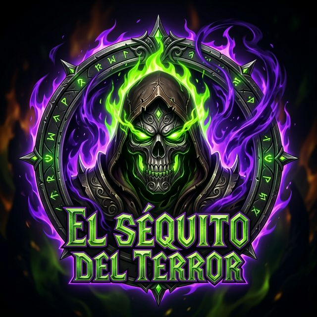

<div align="center">
  
  <h1>El Séquito — Portal Oficial</h1>
  <p><strong>La hermandad más letal y avanzada de WoW Perú (Reino Andino) tiene su propio ecosistema digital.</strong></p>
</div>

---

[](./LICENSE)
[](https://opensource-form.netlify.com/)
[-blue.svg)](https://wow-peru.lat/)
[-gold.svg)](https://wow-peru.lat/)
[](https://github.com/DarckRovert/SequitoWeb/releases)

---

## 👁️ ¿Qué es este repositorio?

Este repositorio contiene el **código fuente Front-End** de la página de aterrizaje oficial de **El Séquito**, la hermandad de élite del servidor **WoW Perú — Reino Andino (WotLK 3.3.5a Build 12340)**, liderada por **Elnazzareno** (DarckRovert). 

Construida con HTML5 semántico, CSS3 moderno con estética *Cyber-Void & Oro Andino* y JavaScript Vanilla reactivo acelerado por GPU, diseñada para ofrecer máxima velocidad de carga e impacto visual sin dependencias pesadas.

---

## 🏛️ Secciones del Portal

| Sección | Contenido |
|---|---|
| **Hero** | Presentación de la hermandad en el Reino Andino y llamadas a la acción |
| **El Líder** | Perfil, rol y enlaces de transmisión de Elnazzareno |
| **Lore** | Las Crónicas canónicas del Vacío y la conquista de la Forja Andina (Actos I al V) |
| **Arsenal 3.3.5a** | Los 5 pilares oficiales del ecosistema de addons de WoW Perú con enlaces a GitHub |
| **Desarrolladores** | Arquitectura de Gravity AI Bridge V15.1 PRO y herramientas locales |
| **Instalación** | Guía de configuración del `realmlist.wtf`, copiado interactivo y descarga de addons |
| **Miembros** | Convocatoria y cónclave de guerreros del clan |
| **Reclutamiento** | Requisitos para bandas de nivel 80 (ICC, Ulduar, ToC, RS) y Discord |
| **Tributo & Footer** | Mantenimiento comunitario, licencia MIT y atribución Netlify |

---

## ⚡ Stack Técnico

- **HTML5** — Semántico, modular y accesible.
- **CSS3 Moderno** — Variables CSS (`--gold-andino`, `--void-purple`, `--fel-green`, `--frost-ice`), glassmorphism y aceleración por hardware.
- **JavaScript Vanilla (ES6+)** — Sin dependencias (Zero-Frameworks), motor de partículas Canvas 2D y observers de visibilidad.
- **Fuentes Web**: Google Fonts (*Cinzel* para títulos de fantasía oscura, *Inter* para claridad de datos).
- **Hosting**: Netlify (Open Source Plan).

---

## 🌐 Ecosistema Oficial de Addons (WoW Perú 3.3.5a)

El portal es la vitrina oficial de las herramientas desarrolladas por DarckRovert y el equipo de WoW Perú:

| Addon / Sistema | Versión | Propósito Principal | Repositorio Oficial |
| :--- | :--- | :--- | :--- |
| **`WoWPeru_RaidSuite`** | `v11.0.0` | Suite de combate, macros 30 specs, Loot Council, HUD y wipes | [Ver Repositorio](https://github.com/DarckRovert/WoWPeru_RaidSuite) |
| **`WoWPeru_BattlePass`** | `v2.0.0` | Pase de Batalla estacional de 50 niveles (La Forja Andina) | [Ver Repositorio](https://github.com/DarckRovert/WoWPeru_BattlePass) |
| **`WoWPeru_Companion`** | `v1.0.1` | Hub social meta-ligero, radar P2P de grupo y anuncios | [Ver Repositorio](https://github.com/DarckRovert/WoWPeru_Companion) |
| **`WoWPeru_GameModes`** | `v1.0.0` | Selector cinematográfico de retos Hardcore (1 vida) e Ironman | [Ver Repositorio](https://github.com/DarckRovert/WoWPeru_GameModes) |
| **`WowPeruVisualShop`** | `v1.0.0` | Catálogo cosmético de 18 alas dinámicas, 40+ auras y títulos | [Ver Repositorio](https://github.com/DarckRovert/WowPeruVisualShop) |
| **`Gravity AI Bridge`** | `v15.1 PRO` | Orquestador local-first de IA y herramientas para desarrolladores | [Ver Repositorio](https://github.com/DarckRovert/Gravity_AI_bridge) |

---

## 🚀 Conexión Rápida a WoW Perú

1. Abre tu archivo `realmlist.wtf` en la carpeta de tu cliente WoW 3.3.5a:
   ```text
   set realmlist logon.wow-peru.lat
   ```
2. Instala los addons en `World of Warcraft\Interface\AddOns\`.
3. Inicia el juego, marca **"Cargar accesorios desactualizados"** en el menú de AddOns y únete a nuestras filas.

---

## 📖 Documentación & Wiki

- 🏛️ [Arquitectura del Sistema (wiki/Arquitectura.md)](wiki/Arquitectura.md)
- ❓ [Preguntas Frecuentes (wiki/FAQ.md)](wiki/FAQ.md)
- 📜 [Manual de Usuario (wiki/Manual_Usuario.md)](wiki/Manual_Usuario.md)
- 💻 [Guía de la API de Frontend (wiki/Guia_API.md)](wiki/Guia_API.md)

---

## ⚖️ Gobernanza & Open Source

Este proyecto está postulado para el **Netlify Open Source Plan** y cumple con todos sus lineamientos:
1. ✅ **Licencia OSI** — [Licencia MIT](./LICENSE).
2. ✅ **Código de Conducta** — [Contributor Covenant v2.1](./CODE_OF_CONDUCT.md).
3. ✅ **Badge de Atribución** — "Powered by Netlify" en el footer y documentación.
4. ✅ **Proyecto Comunitario No Comercial** — Sin fines de lucro.

---
© 2026 **DarckRovert (Elnazzareno)** — El Séquito | [WoW Perú — Reino Andino](https://wow-peru.lat/)

[](https://www.netlify.com)
